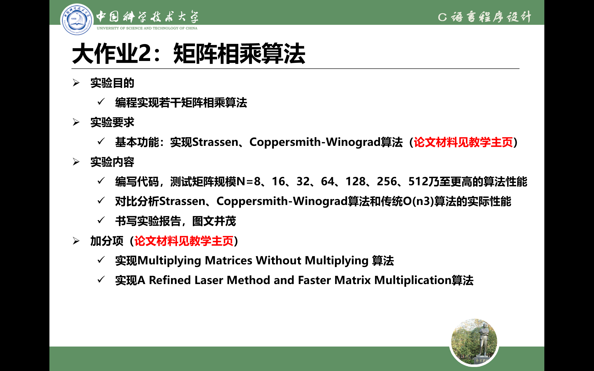

# 
大作业2：矩阵相乘算法

## 
功能实现概述

### 一、矩阵结构的输入
1. **格式化输入**
2. **文件输入**
3. 
### 二、矩阵运算

## 
本矩阵操作库使用说明

#### 一、**定义矩阵变量时请将其指针初始化为0，例：**`struct matrix A = {4,4,NULL};`

#### 二、函数传指针与不传指针
1. **初始化矩阵传指针**
2. **输入矩阵时传指针**
3. **运算结果传指针**
4. **其余均不传指针**
___*翻译：只有往矩阵里写必须用的时候才用指针*___
#### 三、矩阵数据类型可选，可在头文件中修改